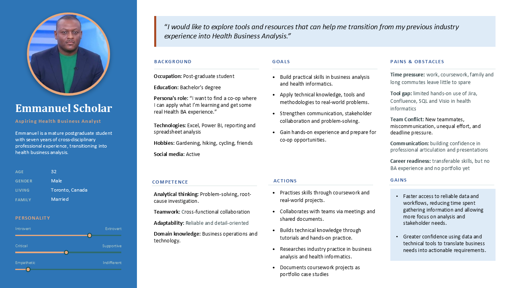

# User Persona: Aspiring Health Business Analyst

**Course:** BUS 4053 – Applied Business Analytics, George Brown College (Fall 2026)

**Type:** Team assignment

## Project requirement
Build a research-based persona that represents our team as aspiring health business analysts, using the BABOK v3 personas technique (10.43). The persona had to be grounded in research, not opinion, written as a narrative, and aligned to BA underlying competencies. It serves as a baseline for reflecting on and improving our BA practice throughout the semester.

## Approach
1. Researched team members' backgrounds, goals and challenges
2. Segmented common traits into one representative user
3. Defined demographics, background, goals, pains and gains
4. Mapped traits to BA competencies
5. Designed the persona layout

## My role
- [what you did]

## Tools
PowerPoint

## Persona

[Download slide (.pptx)](GBC_Student_Persona.pptx)
